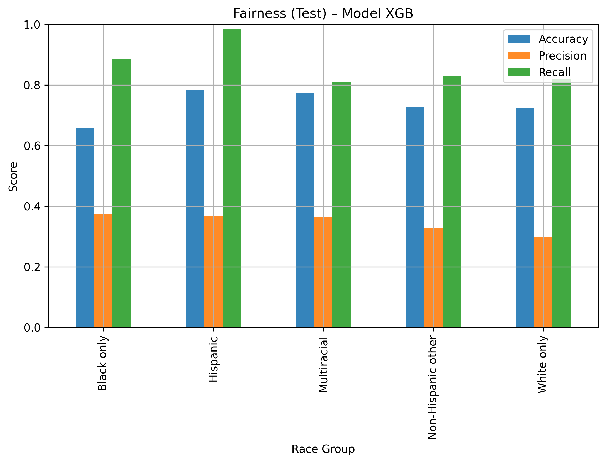

#  Project 2: Diabetes Prediction and Fairness Evaluation (BRFSS 2023)

##  Overview
This project predicts diabetes risk using the **2023 Behavioral Risk Factor Surveillance System (BRFSS)** dataset.  
The goal was to build a model that is **both accurate and fair** across racial and ethnic groups — a critical requirement for real-world healthcare applications.

Fairness was a central focus: high overall accuracy can hide disparities between groups, which in healthcare can lead to unequal access, diagnosis, and treatment.

---

##  Motivation
This project began with more than just an interest in machine learning — it was driven by a personal curiosity about **health disparities**, particularly around diabetes and its impact on Black communities.

There is a frequent narrative — sometimes backed by data, sometimes by assumptions — that Black individuals face a higher burden from chronic illnesses like diabetes.  
I wanted to investigate this claim using **real public health data** and see how predictive models behave across different racial groups.

By analysing the BRFSS 2023 dataset, I explored:
- How diabetes prevalence varies between groups.
- How different models (Logistic Regression, Random Forest, XGBoost) perform across those groups.
- Whether models maintain fairness while achieving high accuracy.

The aim was not just technical — it was about **building trust in AI systems for healthcare**.

---

##  Key Objectives
- Process and prepare a large-scale public health dataset for modelling.
- Explore and engineer features using **mutual information** and **domain knowledge** (including CDC’s official codebook).
- Train a **baseline model** (Logistic Regression) and compare it to **tree-based models**.
- Evaluate **fairness** through group-wise precision, recall, and accuracy for `_RACEGR3`.
- Analyse disparities and their implications for health equity.

---

##  Dataset
**Source:** [CDC BRFSS 2023](https://www.cdc.gov/brfss/annual_data/annual_2023.html)  
**Target Variable:** `DIABETE4` (Binary: Has diabetes or not)  
**Sensitive Feature for Fairness:** `_RACEGR3` (Five-level race/ethnicity category)

---

##  Workflow

### 1. **Data Preprocessing**
- **EDA-driven feature review** using bar plots, mutual information (MI), and Pearson correlation.
- Dropped features with low MI, low correlation, and high missingness.
- Handled missing values using median (numeric) or mode (categorical) imputation.
- Removed certain binary features with low signal (e.g., low MI and high null rate).

### 2. **Feature Engineering**
- Label encoding for binary features.
- One-hot encoding for multi-class features like `_RACEGR3`.
- Numeric features scaled with `StandardScaler` inside a pipeline.

### 3. **Feature Selection**
- Combined MI and correlation thresholds to keep high-signal, low-redundancy features.

---

##  Models
- **Logistic Regression (Baseline)** — with `class_weight='balanced'` to address imbalance.
- **Random Forest** — fine-tuned for better recall and non-linear feature handling.
- **XGBoost** — final chosen model based on validation and test set performance.

---

##  Example Overall Metrics (Validation)

| Model               | Accuracy | Precision | Recall | F1 Score |
|--------------------|----------|-----------|--------|----------|
| Logistic Regression|    0.75    | 0.33      | 0.78    |0.46        |
| Random Forest      |    0.74   | 0.32      | 0.80      | 0.46        |
| XGBoost            |    0.725   | 0.313       | 0.828    | 0.454       |

(*Full results are available in the notebook*)

---

##  Fairness Findings

### Key Observations
- Disparities in recall and precision were present **across all models**.
- **Black Only** group often had the **highest recall** but **lowest accuracy**.
- **Random Forest** showed the smallest recall disparity but still had uneven precision.
- Precision and recall trade-offs were visible: increasing recall often lowered precision.

These results highlight that:
- **Overall performance is not equal to fairness.**
- Models may be more sensitive (higher recall) for some groups but less precise.
- Group-specific prevalence and sample size influence fairness metrics.

---

### Final Test Fairness Evaluation

The final model (XGBoost) was evaluated on the test set for fairness across racial/ethnic groups (_RACEGR3).
Below is the visual comparison of Accuracy, Precision, and Recall for each group.

**Visual Comparison**

**Exact Values**

| Race/Ethnicity               | Accuracy | Precision | Recall | Support|
|--------------------|----------|-----------|--------|----------|
| Black Only |    0.66    | 0.38      | 0.88    | 1613        |
| White Only       |    0.72   | 0.30      | 0.82      | 18549     |
| Hispanic        |    0.78   | 0.37      | 0.98   | 575      |
| Multiracial |    0.77    | 0.36      | 0.81    |2121       |
|    Non-Hispanic Other    |    0.73   | 0.33      | 0.83     | 1230        |

For detailed observations and interpretation, see the Conclusion section in the notebook.
Additional group-wise plots for all models are available in the `output/` directory.

---

##  Folder Structure
Project2_Diabetes_Fairness/
│
├── data/ # Raw & processed datasets
├── # Jupyter notebook with full pipeline
├── artifacts/ # Saved final model
├── outputs/ # Evaluation metrics & fairness plots
└── README.md # Project documentation

---

##  License
This project uses publicly available CDC BRFSS data. No personal identifiers are included.
